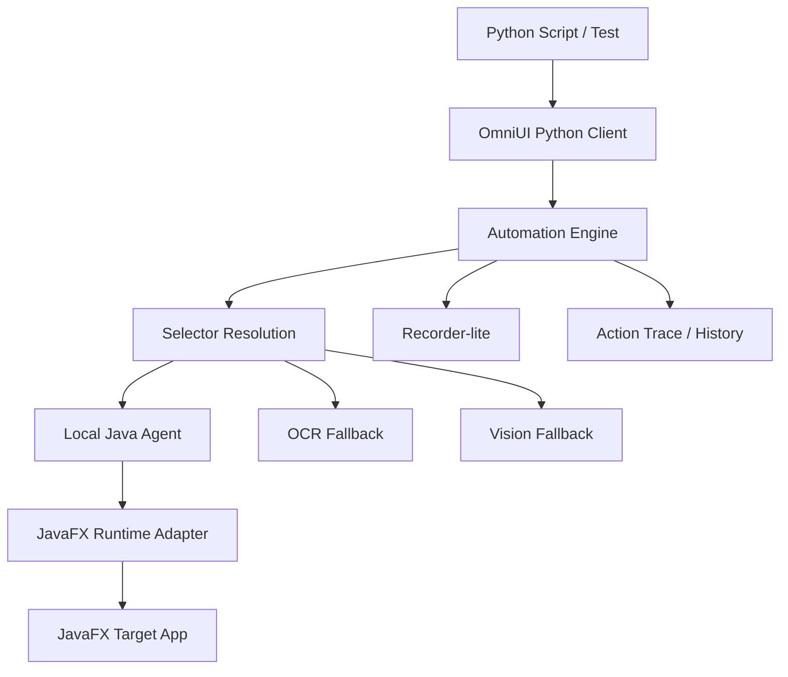
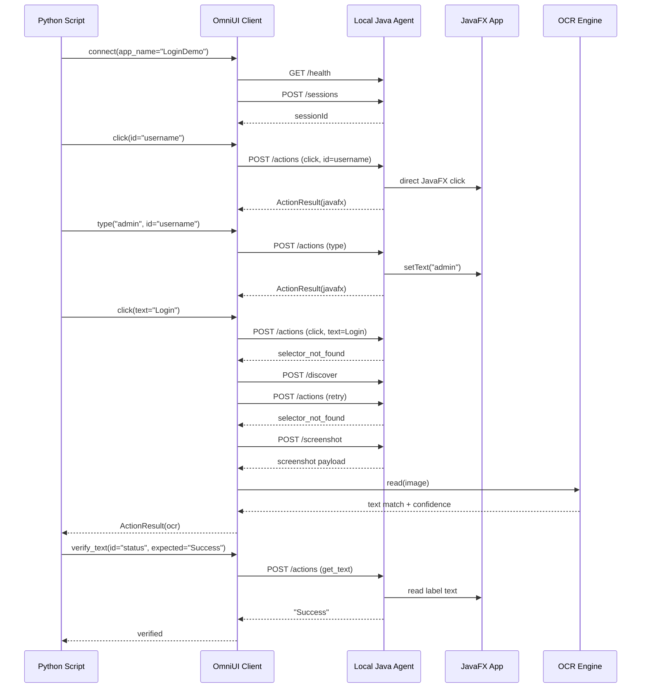
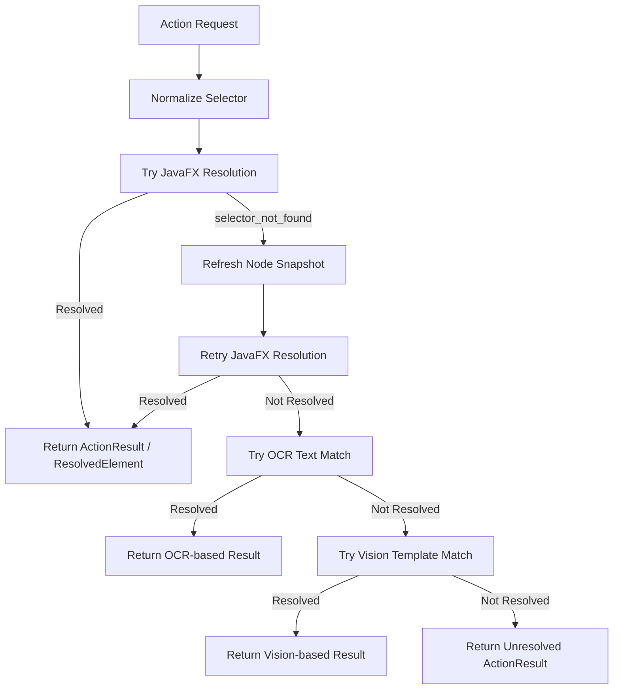

# OmniUI Architecture

This page collects the current Phase 1 architecture diagrams for OmniUI.

## System Architecture



## Login Flow Sequence



## Selector Resolution Flow



## Recorder-lite Flow

```mermaid
flowchart TD
    Action[Executed Action] --> History[Append to action_history]
    History --> Recorder[RecorderLite reads ActionLogEntry]
    Recorder --> CheckClick{Action is successful click?}
    CheckClick -->|No| Skip[Skip entry]
    CheckClick -->|Yes| CheckId{Selector has id?}
    CheckId -->|Yes| EmitId[Emit click(id="...")]
    CheckId -->|No| CheckTypeText{Selector has text and type?}
    CheckTypeText -->|Yes| EmitTypeText[Emit click(text="...", type="...")]
    CheckTypeText -->|No| CheckOcr{Resolved via OCR and selector has text?}
    CheckOcr -->|Yes| EmitText[Emit click(text="...")]
    CheckOcr -->|No| SkipStable[Skip unstable interaction]
```

## Notes

- The current fallback path records OCR or vision resolution but does not yet dispatch a real OS-level click for fallback bounds.
- The JavaFX path is the primary supported execution path in Phase 1.
- Recorder-lite is generated from action history after execution rather than full low-level desktop recording.
