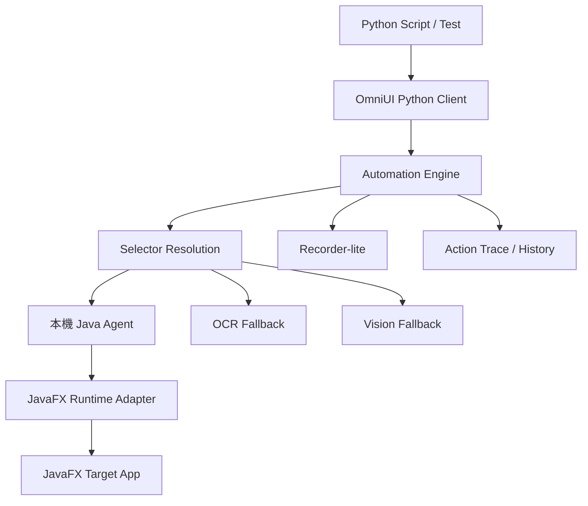
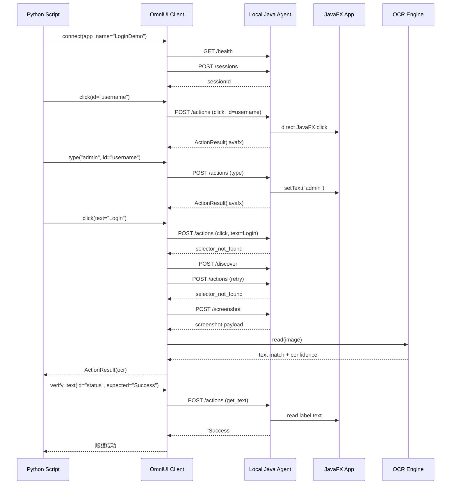
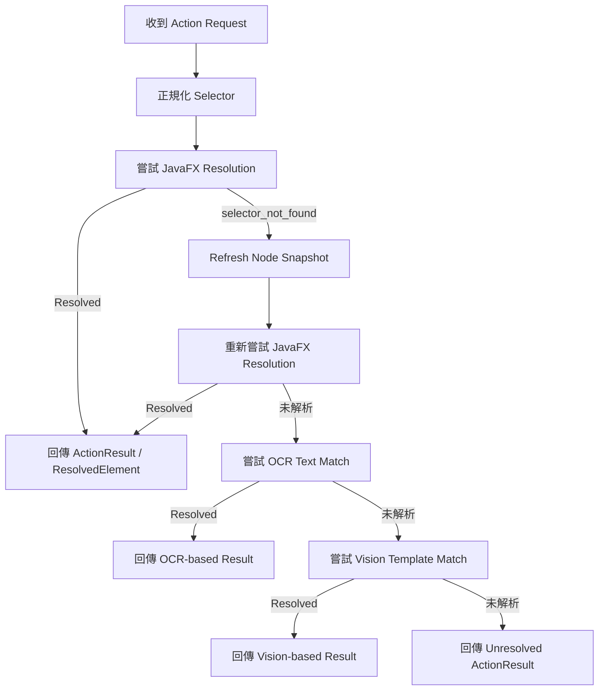

# OmniUI 架構圖

本頁整理 OmniUI Phase 1 目前的架構圖。

## 系統架構圖



## Login Flow Sequence Diagram



## Selector Resolution Flow



## Recorder-lite Flow

```mermaid
flowchart TD
    Action[Action 已執行] --> History[寫入 action_history]
    History --> Recorder[RecorderLite 讀取 ActionLogEntry]
    Recorder --> CheckClick{是否為成功 click?}
    CheckClick -->|否| Skip[略過此 entry]
    CheckClick -->|是| CheckId{Selector 是否有 id?}
    CheckId -->|是| EmitId[輸出 click(id="...")]
    CheckId -->|否| CheckTypeText{Selector 是否有 text 與 type?}
    CheckTypeText -->|是| EmitTypeText[輸出 click(text="...", type="...")]
    CheckTypeText -->|否| CheckOcr{是否為 OCR resolve 且 selector 有 text?}
    CheckOcr -->|是| EmitText[輸出 click(text="...")]
    CheckOcr -->|否| SkipStable[略過不穩定互動]
```

## 補充說明

- 目前 fallback path 會記錄 OCR / vision resolution，但尚未對 fallback bounds 發出真正的 OS-level click。
- Phase 1 的主執行路徑仍然是 JavaFX direct interaction。
- Recorder-lite 是根據 action history 產生，而不是完整的低階桌面錄製。
